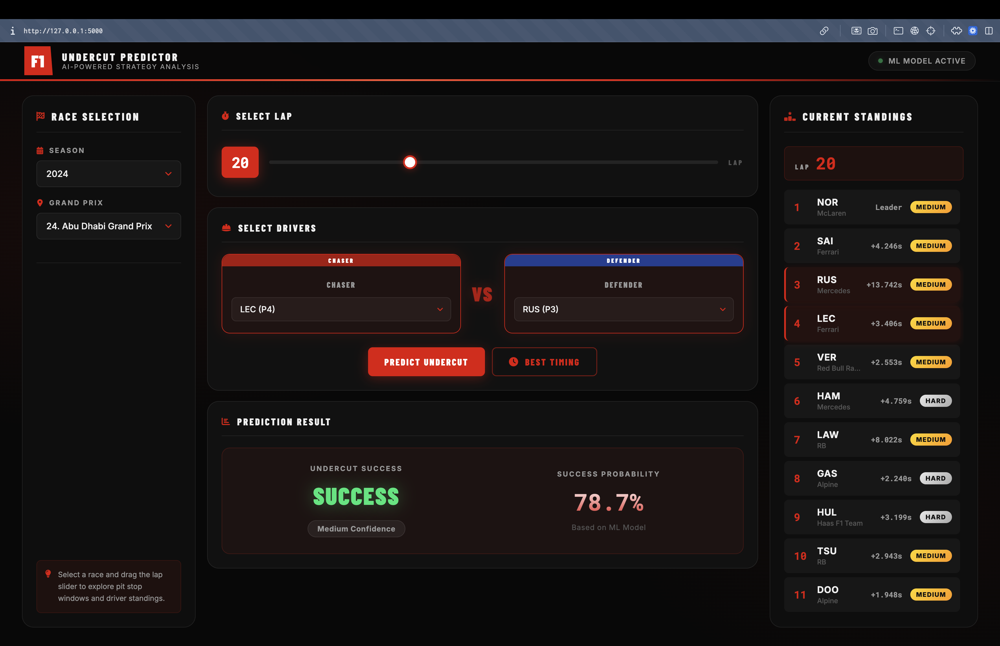
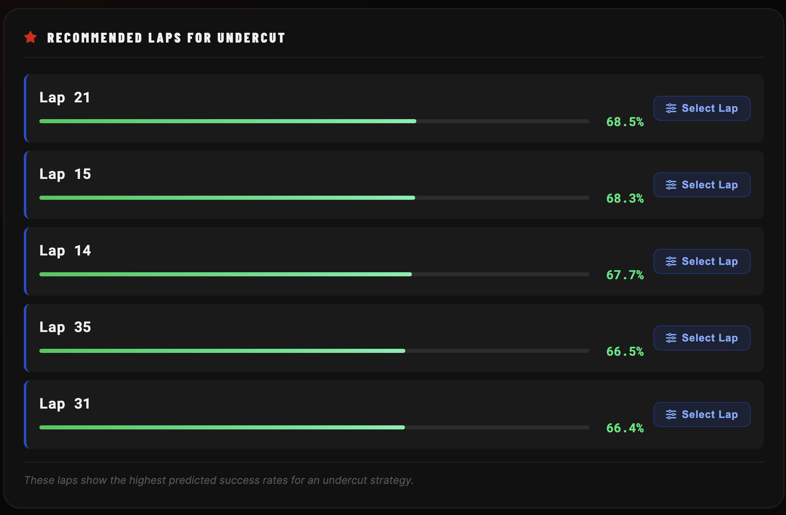

# 🏎️ F1 Undercut Predictor



A Machine Learning-powered web application that analyzes Formula 1 race data to predict the success of an undercut strategy between two drivers. 

An undercut is a strategic pit stop maneuver where a chasing driver pits earlier than the defending driver ahead of them, utilizing the performance advantage of fresh tires to close the gap and overtake the defender once they make their own pit stop.

## ✨ Features

* Data Extraction: Automated fetching of historical F1 race, lap, and telemetry data (2022-2024) using the FastF1 API.
* Interactive Dashboard: A clean, responsive web interface built with HTML/CSS/JS to explore races.
* Race State Reconstruction: View the exact driver standings, gaps, and tire compounds for any given lap in a race.
* Undercut Prediction: Select a "Chaser" and a "Defender" to calculate the real-time probability of a successful undercut based on a trained machine learning model.
* Best Timing Optimizer: Analyzes multiple laps to recommend the best possible lap for a chaser to execute the undercut strategy.

## 🛠️ Tech Stack

* Backend: Python, Flask, Pandas, NumPy
* Machine Learning: Scikit-learn, Joblib (Random Forest / Data Mining Models)
* Data Source: FastF1 API
* Frontend: HTML5, CSS3, Vanilla JavaScript

## 📂 Project Structure

    f1-undercut-predictor-app/
    ├── app.py                      # Main Flask application and API endpoints
    ├── extract_f1_data.py          # Script to fetch F1 data and generate CSVs
    ├── Datamining_model_final.pkl  # Trained ML model
    ├── f1_data/                    # Directory containing generated CSV datasets
    │   ├── f1_2022_2024.csv        # Combined raw lap data
    │   ├── events_summary.csv      # Summary of all races
    │   ├── drivers_summary.csv     # Summary of drivers per race
    │   └── pit_laps_summary.csv    # Summary of laps containing pit stops
    ├── templates/
    │   └── index.html              # Frontend UI template
    └── static/
        ├── css/style.css           # UI Styling
        └── js/app.js               # Frontend logic and API integration

## ⚙️ Core Prediction Features

The machine learning model uses 7 core metrics calculated at the time of the pit stop to determine undercut success:

1. Gap_To_Ahead: Time gap to the defending driver.
2. Rival_Tyre_Age: How many laps old the defender's tires are.
3. Pace_Delta: Lap time difference between the chaser and defender.
4. Pit_Aggressiveness: How early the pit stop is compared to the average for that tire compound.
5. StationaryDuration: Expected time spent stationary in the pit box.
6. InLap_Sec: Chaser's pace entering the pits.
7. OutLap_Sec: Chaser's pace exiting the pits.

## 🚀 Quick Start / Installation

1. **Clone the repository**:
   ```bash
   git clone https://github.com/yourusername/f1-undercut-predictor-app.git
   cd f1-undercut-predictor-app
   ```

2. **Install dependencies**:
   Ensure you have Python installed, then run:
   ```bash
   pip install -r requirements.txt
   ```

3. **Run the application**:
   ```bash
   python app.py
   ```
   The app will be available at `http://127.0.0.1:5000` in your web browser.

*(Note: Pre-extracted historical race data is provided in the `f1_data/` folder. To manually fetch new data, you can execute `python extract_f1_data.py`.)*

## 💻 Usage Guide

Once the application is running, you can interact with it via your web browser:

1. Select Race: Choose a Season (2022, 2023, or 2024) and a Grand Prix from the left panel.
2. Select Lap: Use the slider to pick a lap. The right panel will reconstruct the exact driver standings at that moment.
3. Pick Drivers: From the standings, select your "Chaser" (the car attempting the undercut) and "Defender" (the car ahead).
4. Predict:
   * Click "Predict Undercut" to see the probability of success if the chaser pits on the currently selected lap.
   * Click "Predict Best Timing" to calculate and rank the top 5 most optimal laps for the chaser to pit.



## ⚠️ Disclaimer

This project is for educational and entertainment purposes. It is not affiliated with, endorsed by, or sponsored by Formula One World Championship Limited or any of its affiliates.
